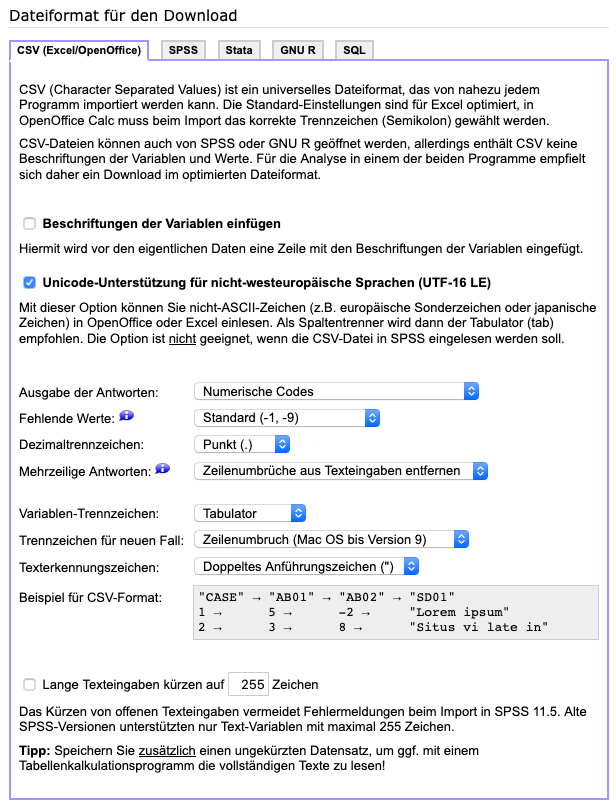

# SoSci Questionnaire Evaluation

This repository contains (1) analysis code used to assess students' questionnaires of the Analyze Your Personal Genome, Understanding Your Genome, and Genomic Medicine lectures as supplementary material to the accompanying paper (**link will be added when published**, see `genomics-lecture-specific/analyze-data/complete-analysis/CompleteAnalysis.Rmd`), and (2) **an RShiny-based tool to visualize and evaluate ScoSci Survey questionniare results** (which might be more interesting).

The tool was created to evaluate the questionnaires of the mentioned lectures; it should, however, be applicable to other SoSci Survey questionnaires.

## Genomics Lecture Specific Content

The code that is specific to the lectures is separated in the `genomics-lecture-specific` directory. It holds a script to clean results, app configurations for the RShiny app, and R Markdown scripts for a first analysis and the complete analysis. Unfortunately, we cannot publish the underlying data because we do not have consent; for details, please refer to the paper mentioned above.

## RShiny Tool

### Prerequisites

* R (tested with version `4.0.0`)
* R packages `rjson`, `rstatix`, `shiny`, `stringr` and `shinycssloaders` (might be I forgot some, in this case, I am sorry; but you will know which ones from error messages)
* Potentially RStudio (makes it easier to edit and run)

### Setup

* Export your results from SoSci Survey as CSV files (see [Data Export](#data-export))
* Copy or rename `example.data_path.json` to `data_path.json` and adapt if needed (default is `data`)
* If needed, create the data directory you entered in the `data_path.json`
* Copy your CSV files (`data_*.csv`, `values_*.csv`, and `variables_*.csv`) to the data directory
* Copy or rename `example.config.json` to `<data_path>/config.json` and adapt if needed (see [Configuration](#configuration))
* In case you need to make adaptions to your data you can do that using the files in the `scripts` folder

### Execution

Run `app.R` (will be available on `http://localhost:8888`)
* In RStudio (you can open `sosci-questionnaire-evaluation.Rproj` and proceed from there)
* With running `R -e "shiny::runApp('./app.R', host = '0.0.0.0', port = 8888)"` in the `sosci-questionnaire-evaluation` respository directory
  * Run in background with `nohup` and `&>/dev/null &`
  * Can be stopped with `kill $(lsof -t -i:8888)`

### Data Export

Please make sure that the data is downloaded with the following settings:



If you checked the variable annotation, please remove the annotation row in the data so that the CSV file contains the header in the first line and data from the second line on.

If you need to do adaptions to your data, you can do this in the files included in `scripts/`; changes here should not be committed.

### Configuration

* When giving replacements, they usually work across all questionnaires; this is not the case for answer replacements. For each question ID, a list of objects with the following structure needs to be given: `{ "questionnaires": [QUESTIONNAIRE_IDS], "text": "HTML_TEXT" }`.
* For connected questions, meaning questions from different questionnaires that have not the same ID but should be shown together, a list of prefix IDs (without the part after the underline) needs to be given.
  * Connected questions will be rendered right next to each other (breaking the given order in the questionnaire)
  * Connected questions override hidden questions (do not state questions in connected questions that should be hidden)
  
## Asset Scripts

Some asset scripts were created that can be run with `Rscript --vanilla assets/<script_name>.R <script_parameters>` from the root of this project. If you receive warnings that locals are not set, prepend `LC_ALL=en_US.UTF-8`.
  
### Anonymization

The script `assets/anonymizeData.R` anonymizes data by assigning new, random `SERIAL` values. It receives a directory containing the exported CSV data (`<data_path>`) and traverses all contained CSV files (also in subdirectories). The script requires the `uuid` and the `stringr` packages.

Hint: To delete all created anonymized files type `find . -name *_anonymized.csv -delete`

### Combine Data of Single Questionnaires

The function `combineResultData` in `assets/combineResultData.R` combines data of input directories and saves them in an output directory. It receives a list of input directories and the output directory, which will be created if it is not present.

If the different input directories contain different questions with the same question ID, new question IDs can be specified in a `combination_config.json` file of the output directory (needs to be created before combining): for each duplicate ID, an alternative ID can be given and the data paths it applies to (as given as input directories). An example is shown below:

```
"makeQuestionIdsUnique": {
  "Q405": {
    "newQuestionId": "old_Q405",
    "inputDirectories": ["data/TUM_Q1", "data/TUM_Q2", "data/TUM_Q3"]
  },
  "Q407": {
    "newQuestionId": "old_Q407",
    "inputDirectories": ["data/TUM_Q1", "data/TUM_Q2", "data/TUM_Q3"]
  }
}
```

Please note that new question IDs should not not start with present question IDs (like in `old_Q405`), otherwise the code will break.

If the different input directories contain the same questions with different question IDs, the question ID that should apply for all and the question IDs that should be changes can also the given in the config file:

```
"normalizeQuestionIds": {
  "QX08": "old_Q405",
  "QX07": ["T107", "Q414"],
  "QX11": "old_Q407"
}
```
